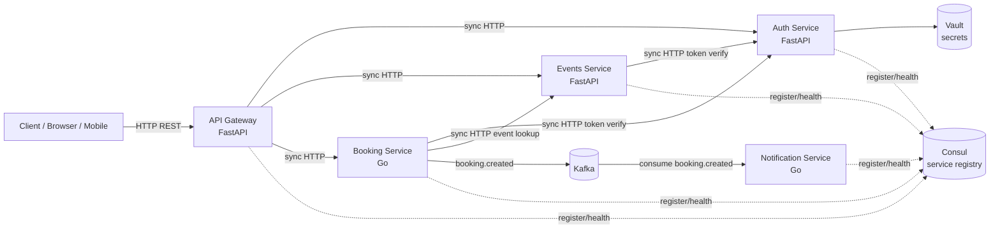

# Architecture

## Service boundaries

The project models an event booking system with a fixed set of services:

| Service | Technology | Responsibility |
| --- | --- | --- |
| `gateway` | FastAPI | Public API facade, routing, single client entry point |
| `auth-service` | FastAPI | User registration, login, token verification, auth secrets from Vault |
| `events-service` | FastAPI | Event catalog, event capacity metadata |
| `booking-service` | Go | Booking workflow, consistency checks, Kafka event publishing |
| `notification-service` | Go | Asynchronous notification processing from Kafka |

## Architecture diagram

The diagram source is in [diagrams/context.mmd](diagrams/context.mmd).

## Sync communication

Synchronous HTTP is used when the caller needs an immediate answer:

- `gateway -> auth-service`: registration and login.
- `gateway -> events-service`: event listing and creation.
- `gateway -> booking-service`: booking creation and booking lookup.
- `booking-service -> events-service`: event existence and capacity check before booking.
- `events-service/booking-service -> auth-service`: token verification.

## Async communication

Kafka is used after the booking transaction boundary:

- `booking-service` publishes `booking.created`.
- `notification-service` consumes `booking.created` and prepares notification delivery.

This keeps user-facing booking latency independent from email/SMS/push delivery.

## Consul

Each service registers itself in Consul on startup and exposes `/health`. In this demo, service URLs are still passed through environment variables for simplicity, while Consul demonstrates service discovery and health registry responsibilities.

## Vault

`auth-service` reads `secret/event-booking/auth` from Vault and uses `jwt_secret` as the token signing secret. The compose file starts Vault in dev mode and writes the demo secret through `vault-init`.

## Trade-offs

- FastAPI is used for gateway/auth/events because these services are API-heavy, quick to iterate on, and benefit from Pydantic validation and OpenAPI docs.
- Go is used for booking/notification because these services are more concurrency- and infrastructure-oriented: HTTP workflow orchestration, Kafka producer/consumer loops, and predictable runtime behavior.
- HTTP sync calls are simple and transparent, but create runtime coupling. Timeouts and retries would be mandatory in production.
- Kafka decouples booking from notifications and allows retry/replay, but introduces delivery semantics, consumer lag, schema evolution, and operational complexity.
- In-memory stores keep the homework runnable without extra databases. Production would split persistence by bounded context: users, events, bookings, and notification outbox/state.
- Consul and Vault are included as explicit infrastructure responsibilities. In production they would require ACLs, TLS, policies, sealed/unsealed lifecycle, and stronger bootstrap automation.
